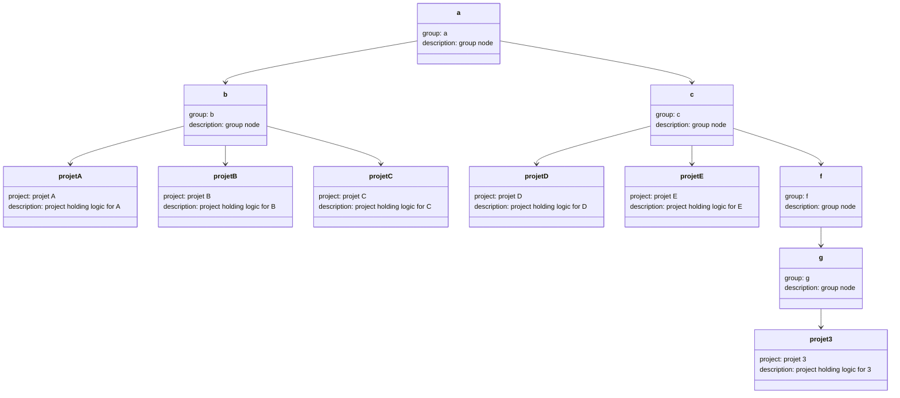

```mermaid
classDiagram
class a{group: a
description: group node}
class b{group: b
description: group node}
a --> b
class projet A{project: projet A
description: project holding logic for A}
b --> projet A
class projet B{project: projet B
description: project holding logic for B}
b --> projet B
class projet C{project: projet C
description: project holding logic for C}
b --> projet C
class c{group: c
description: group node}
a --> c
class projet D{project: projet D
description: project holding logic for D}
c --> projet D
class projet E{project: projet E
description: project holding logic for E}
c --> projet E
class f{group: f
description: group node}
c --> f
class g{group: g
description: group node}
f --> g
class projet 3{project: projet 3
description: project holding logic for 3}
g --> projet 3
```
